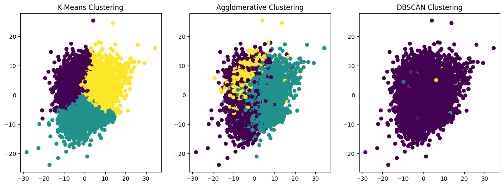

# spaCy_tutorial
Python中的工业级自然语言处理（NLP）工具包 —— spaCy学习记录

# 快速开始

## 1. 安装
```bash
pip install -U spacy # cpu版本
```
## 2. 加载模型

```python
import spacy
nlp = spacy.load('zh_core_web_md') # 中文预训练模型
```

## 3. 使用
```python
doc = nlp(u'宠物的家在哪啊？')
for token in doc:
    print(token.text, token.pos_, token.dep_)

#   宠物 NOUN nmod:assmod
#   的 PART case
#   家 NOUN nsubj
#   在 VERB dep
#   哪 PRON dobj
#   啊 PART discourse
#   ？ PUNCT ROOT
```
## 4. 词向量
```python
import numpy as np
# 词向量
print(nlp.vocab['北京'].vector)

# 词向量距离
print(nlp.vocab['北京'].vector_norm)
# 42.057384

# 词向量长度
print(np.sqrt((nlp.vocab['广州'].vector ** 2).sum()))
# 6.4851665

# 词向量与词的相似度
print(nlp.vocab['广州'].similarity(nlp.vocab['番禺']))
# 0.6170334815979004
```

# 学习笔记

 - [第一章: 词语、短语、名字和概念的检索](spaCy0.ipynb)

 - [第二章：使用spaCy进行大规模数据分析](spaCy1.ipynb)

 - [第三章：处理流程](spaCy2.ipynb)

 - [第四章：训练神经网络模型](spaCy3.ipynb)

# 效果展示

根据spaCy中文预训练模型，提取文本内容特征，用聚类方法将话题分类。

并使用sklearn进行分类预测。


---
相关参考和资料来源：
 - https://github.com/explosion/spaCy
 - https://github.com/explosion/spacy-course
